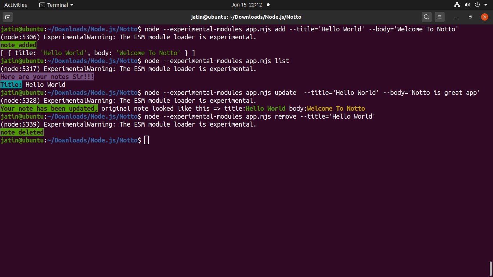
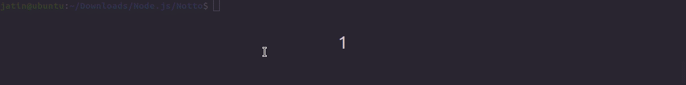
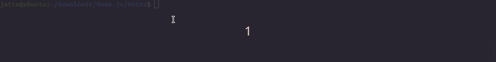
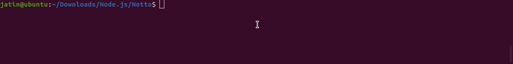
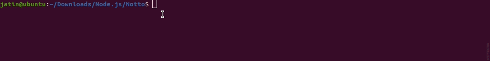

# Notto-node.js-command-line

This repository contains a **note-taking application** that uses command-line arguments for CRUD operations concerning user given notes.

              [](http://makeapullrequest.com) 





## Table of Contents 

> The  `README` contains the following info.
- [General Info](#general-info)
- [Prerequisites](#prerequisites)
- [Built With](#built-with)
- [Installation](#installation)
- [Usage](#usage)
- [Release History](#release-history)
- [License And Author Info](#license-and-author-info)


## General Info

This application uses **Node.js** as a running environment and **Javascript** as its Programming language. It aims to illustrate the use of **command-line arguments,file-handling operations
, use of modules through import and export(ES6 syntax), utilization of array, and its various method like filter and not the least error-handling through try and catch statements**.

_Notto is synchronous, simple, lightweight and easy to use application which provides a command-line interface to **create, read, update, remove notes given by the user through command line**_.

## Prerequisites

Before you continue, ensure you have met the following requirements:
* You have installed the latest version of Node.js.
* This Applicaion uses ES6 syntax, so make sure you use **_.mjs_** extension for your files. 
* You need to mention _**node --experimental-modules app.mjs [options]...**_ for using Notto. See [Usage](#usage)


## Built With
*  <a href="http://yargs.js.org/" target="_blank">**Yargs Library 15.3.1**</a> - helps you build interactive command line tools, by parsing arguments.
*  <a href="https://github.com/chalk/chalk" target="_blank">**Chalk Library 4.1.0**</a> - helps to customize Terminal string styling. 
*  <a href="https://nodejs.org/api/fs.html" target="_blank">**Fs module**</a> - helps to interact with the file system in a manner closely modeled around standard POSIX functions.


## Installation
OS X & Linux & Windows:
*  Open the terminal and enter these commands

> Clone this repo to your local machine  

```shell
  git clone `https://github.com/jatinmehrotra/Notes-node.js-command-line.git`
```
> Change Directory and install npm packages

```shell
  cd to/your/project/directory
  npm install
```


## Usage

> To Create/Add a note
```shell
  node --experimental-modules app.mjs add --title='Hello World' --body='Welcome To Notto'
```

   
> To Read a note

```shell
  node --experimental-modules app.mjs read --title='Hello World'
```  


> To Update a note
```shell
  node --experimental-modules app.mjs update --title='Hello World' --body='Notto is a great app'
```   


> To Remove a note
```shell
  node --experimental-modules app.mjs remove --title='Hello World'
```  

  
> To List all notes
```shell
  node --experimental-modules app.mjs list
``` 


## Release History
* 1.0.0
    * The first proper release
---


## License And Author Info

Jatin Mehrotra  – jatinjmehrotra@gmail.com

Distributed under the GNU General Public License v3.0 license. See ``LICENSE`` for more information.

[https://github.com/jatinmehrotra/repositories](https://github.com/jatinmehrotra)

